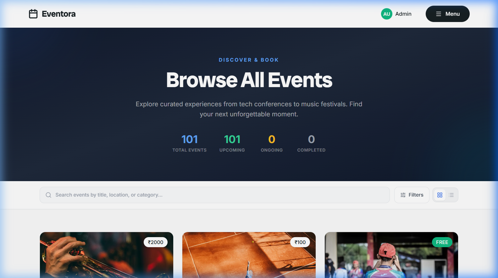
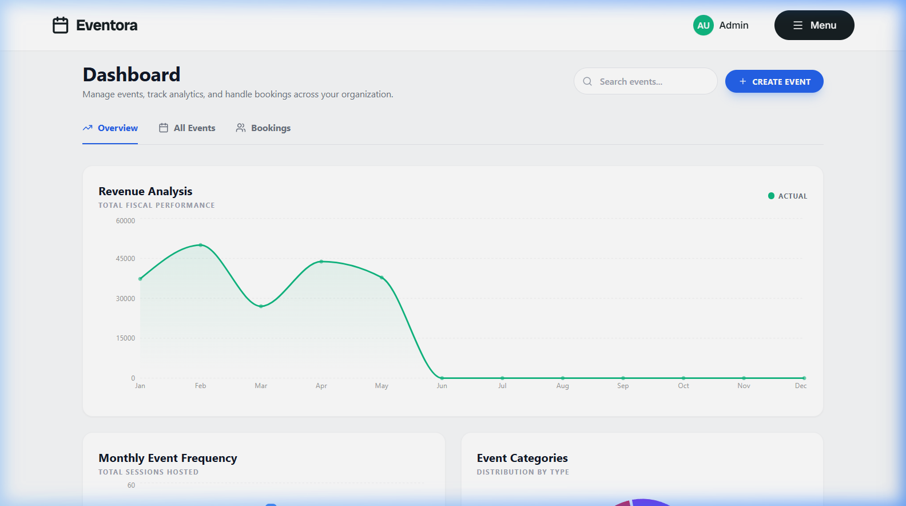
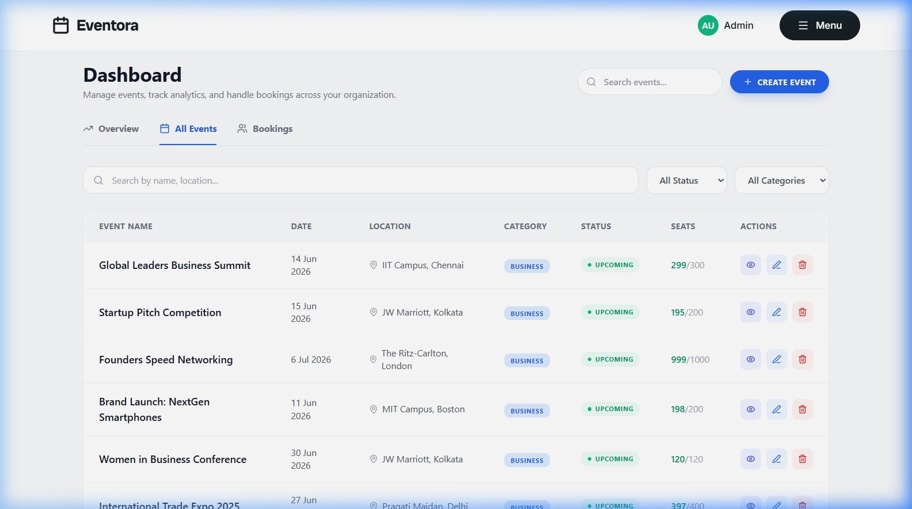

<p align="center">
  
  
  
  
  
  
</p>

<h1 align="center">🎪 Eventora — Event Management System</h1>

<p align="center">
  <strong>A full-stack, production-ready event management platform for discovering, booking, and managing events with real-time payments, OTP verification, and an enterprise-grade admin dashboard.</strong>
</p>

<p align="center">
  <a href="#-features">Features</a> •
  <a href="#-screenshots">Screenshots</a> •
  <a href="#-tech-stack">Tech Stack</a> •
  <a href="#-getting-started">Getting Started</a> •
  <a href="#-api-reference">API Reference</a> •
  <a href="#-project-structure">Project Structure</a> •
  <a href="#-contributing">Contributing</a>
</p>

---

## 🚀 Features

### 🎫 Event Discovery & Booking
- **Smart Category Browsing** — 7 consolidated categories covering all event types (Business, Education, Entertainment, Sports, Tech, Community, Wellness)
- **Advanced Search & Filters** — Search by name, location, category with real-time filtering and pagination
- **Dynamic Hero Section** — Auto-rotating slideshow with live event data and engagement statistics
- **Interactive Event Cards** — Rich cards with category badges, seat availability, pricing, and quick booking actions

### 💳 Payments & Transactions
- **Razorpay Integration** — Full payment gateway with order creation, verification, and webhook handling
- **UPI QR Code Generation** — Native UPI payment support for Indian users
- **Payment Receipts** — Automated payment confirmation with transaction IDs and booking references
- **Free Event Support** — Zero-price events with instant booking confirmation

### 🔐 Authentication & Security
- **OTP-Based Registration** — Email OTP verification for secure account creation
- **JWT Authentication** — Stateless token-based session management
- **Password Recovery** — Forgot password flow with OTP verification and secure reset
- **Role-Based Access** — Separate User and Admin permission levels

### 📊 Admin Dashboard
- **Revenue Analytics** — Interactive line charts tracking monthly revenue trends
- **Event Management** — Full CRUD operations with inline editing, participant tracking, and event status monitoring
- **Booking Transactions** — Real-time transaction inspector with filtering, search, and detailed booking views
- **Data Visualizations** — Category distribution pie charts, monthly event frequency bar charts powered by Recharts
- **Participant Management** — Per-event attendee lists with search and export capabilities

### 👤 User Dashboard
- **Booking History** — Complete booking timeline with status tracking (Confirmed, Pending, Cancelled)
- **Event Creation** — Users can create and publish their own events via modal form
- **Profile Management** — Edit name, email with real-time validation
- **Quick Actions** — Copy booking IDs, view event details, cancel bookings

### 📱 Responsive Design
- **Mobile-First Layout** — Fully responsive across all breakpoints (375px – 1920px+)
- **Adaptive Components** — Tables convert to card layouts on mobile, panels stack vertically
- **Touch-Friendly UI** — Optimized tap targets, swipe-friendly navigation
- **Professional Footer** — Quick links, contact info, category navigation, social links

---

## 📸 Screenshots

<details>
<summary><strong>🏠 Homepage — Hero Section</strong></summary>
<br>

</details>

<details>
<summary><strong>🎯 Events Exploration Page</strong></summary>
<br>

</details>

<details>
<summary><strong>📊 Admin Dashboard — Overview</strong></summary>
<br>

</details>

<details>
<summary><strong>📋 Admin Dashboard — Event Management</strong></summary>
<br>

</details>

---

## 🛠 Tech Stack

### Frontend
| Technology | Purpose |
|---|---|
| **React 18** | UI component library with hooks & context API |
| **Vite 8** | Next-gen build tool with HMR |
| **Tailwind CSS 3.4** | Utility-first CSS framework |
| **React Router v6** | Client-side routing & navigation |
| **Recharts 3** | Data visualization (charts & graphs) |
| **Lucide React** | Modern icon library |
| **Axios** | HTTP client for API communication |

### Backend
| Technology | Purpose |
|---|---|
| **Node.js** | JavaScript runtime environment |
| **Express 4** | Web application framework |
| **MongoDB + Mongoose 8** | NoSQL database with ODM |
| **JWT** | Stateless authentication tokens |
| **Bcrypt.js** | Password hashing & comparison |
| **Nodemailer** | Email OTP delivery service |
| **Razorpay SDK** | Payment gateway integration |
| **Express Validator** | Request validation middleware |

### Infrastructure
| Technology | Purpose |
|---|---|
| **MongoDB Atlas** | Cloud-hosted database cluster |
| **Razorpay** | Payment processing |
| **Gmail SMTP** | Transactional email delivery |

---

## ⚡ Getting Started

### Prerequisites

- **Node.js** ≥ 18.x
- **npm** ≥ 9.x
- **MongoDB Atlas** account (or local MongoDB instance)
- **Razorpay** account for payments (optional for development)

### 1. Clone the Repository

```bash
git clone https://github.com/ankitchaurasiya8957/college-project-EMS-.git
cd college-project-EMS-
```

### 2. Setup Backend

```bash
cd server
npm install
```

Create a `.env` file in the `server/` directory:

```env
# Database
MONGO_URI=mongodb+srv://<username>:<password>@cluster.mongodb.net/eventora?retryWrites=true&w=majority

# Authentication
JWT_SECRET=your_super_secret_jwt_key

# Email (Gmail SMTP for OTP)
EMAIL_USER=your-email@gmail.com
EMAIL_PASS=your-app-password

# Server
PORT=5000

# Razorpay (optional)
RAZORPAY_KEY_ID=rzp_test_xxxxxxxxxxxxx
RAZORPAY_KEY_SECRET=xxxxxxxxxxxxxxxxxxxx
```

> **📝 Note:** For Gmail, enable [App Passwords](https://support.google.com/accounts/answer/185833) in your Google Account settings.

### 3. Seed the Database (Optional)

```bash
npm run seed
```

This populates the database with **100 demo events** across 7 categories and **350 sample bookings** for testing.

### 4. Start the Backend

```bash
npm run dev
```

Server starts on `http://localhost:5000`

### 5. Setup Frontend

```bash
cd ../client
npm install
npm run dev
```

Frontend starts on `http://localhost:5173`

### 6. Default Admin Credentials

```
Email:    admin@eventora.com
Password: password123
```

---

## 📡 API Reference

### Base URL
```
http://localhost:5000/api
```

### Authentication
| Method | Endpoint | Description | Auth |
|--------|----------|-------------|------|
| `POST` | `/auth/register` | Register new user | — |
| `POST` | `/auth/login` | Login with email/password | — |
| `POST` | `/auth/verify-otp` | Verify email OTP | — |
| `POST` | `/auth/resend-otp` | Resend OTP to email | — |
| `POST` | `/auth/forgot-password` | Initiate password reset | — |
| `POST` | `/auth/verify-reset-otp` | Verify reset OTP | — |
| `POST` | `/auth/reset-password` | Set new password | — |
| `PUT` | `/auth/profile` | Update user profile | 🔒 User |

### Events
| Method | Endpoint | Description | Auth |
|--------|----------|-------------|------|
| `GET` | `/events` | List all events | — |
| `GET` | `/events/:id` | Get event details | — |
| `POST` | `/events/user-create` | Create event (user) | 🔒 User |
| `POST` | `/events` | Create event (admin) | 🔒 Admin |
| `PUT` | `/events/:id` | Update event | 🔒 Admin |
| `DELETE` | `/events/:id` | Delete event | 🔒 Admin |

### Bookings
| Method | Endpoint | Description | Auth |
|--------|----------|-------------|------|
| `POST` | `/bookings/send-otp` | Send booking OTP | 🔒 User |
| `POST` | `/bookings` | Book an event | 🔒 User |
| `GET` | `/bookings/my` | Get my bookings | 🔒 User |
| `DELETE` | `/bookings/:id` | Cancel a booking | 🔒 User |
| `GET` | `/bookings/all` | Get all bookings | 🔒 Admin |
| `PUT` | `/bookings/:id/confirm` | Confirm a booking | 🔒 Admin |
| `GET` | `/bookings/event/:eventId/participants` | Get event participants | 🔒 Admin |
| `GET` | `/bookings/analytics` | Booking analytics | 🔒 Admin |

### Payments
| Method | Endpoint | Description | Auth |
|--------|----------|-------------|------|
| `POST` | `/payments/create-order` | Create Razorpay order | 🔒 User |
| `POST` | `/payments/upi-qr` | Generate UPI QR code | 🔒 User |
| `POST` | `/payments/verify` | Verify payment | 🔒 User |
| `GET` | `/payments/my` | Get my payments | 🔒 User |
| `GET` | `/payments/all` | Get all payments | 🔒 Admin |
| `GET` | `/payments/analytics` | Payment analytics | 🔒 Admin |
| `POST` | `/payments/webhook` | Razorpay webhook | — |

> 🔒 = Requires `Authorization: Bearer <token>` header

---

## 📁 Project Structure

```
college-project-EMS-/
├── client/                          # React Frontend (Vite)
│   ├── public/                      # Static assets
│   ├── src/
│   │   ├── components/              # Reusable UI components
│   │   │   ├── Navbar.jsx           # Navigation bar with auth state
│   │   │   ├── Footer.jsx           # Site-wide footer
│   │   │   ├── EventCard.jsx        # Event listing card
│   │   │   ├── PaymentModal.jsx     # Razorpay payment flow
│   │   │   ├── DashboardCharts.jsx  # Recharts visualizations
│   │   │   ├── EditEventModal.jsx   # Event edit form modal
│   │   │   ├── ProtectedRoute.jsx   # Auth route guard
│   │   │   ├── AdminRoute.jsx       # Admin role guard
│   │   │   └── SectionTag.jsx       # Reusable section label
│   │   ├── context/
│   │   │   └── AuthContext.jsx      # Global auth state management
│   │   ├── pages/
│   │   │   ├── Home.jsx             # Landing page with hero slider
│   │   │   ├── Events.jsx           # Event exploration & search
│   │   │   ├── EventDetail.jsx      # Single event detail + booking
│   │   │   ├── Login.jsx            # Login page
│   │   │   ├── Register.jsx         # Registration with OTP
│   │   │   ├── ForgotPassword.jsx   # Password recovery flow
│   │   │   ├── AdminDashboard.jsx   # Admin control panel
│   │   │   ├── UserDashboard.jsx    # User booking management
│   │   │   ├── UserProfile.jsx      # Profile settings
│   │   │   ├── Contact.jsx          # Contact page
│   │   │   ├── PaymentSuccess.jsx   # Payment confirmation
│   │   │   ├── PaymentFailed.jsx    # Payment failure
│   │   │   └── NotFound.jsx         # 404 page
│   │   ├── services/
│   │   │   ├── authService.js       # Auth API calls
│   │   │   ├── eventService.js      # Event API calls
│   │   │   ├── bookingService.js    # Booking API calls
│   │   │   └── paymentService.js    # Payment API calls
│   │   ├── utils/
│   │   │   └── categories.js        # Category config (colors, icons)
│   │   ├── App.jsx                  # Root component with routing
│   │   ├── main.jsx                 # Entry point
│   │   └── index.css                # Global styles & Tailwind
│   ├── package.json
│   ├── tailwind.config.js
│   └── vite.config.js
│
├── server/                          # Node.js Backend (Express)
│   ├── controllers/
│   │   ├── authController.js        # Auth logic (register, login, OTP)
│   │   ├── eventController.js       # Event CRUD operations
│   │   ├── bookingController.js     # Booking management
│   │   └── paymentController.js     # Razorpay integration
│   ├── middleware/
│   │   ├── auth.js                  # JWT verification & role check
│   │   └── validators.js           # Express-validator rules
│   ├── models/
│   │   ├── User.js                  # User schema
│   │   ├── Event.js                 # Event schema with categories
│   │   ├── Booking.js               # Booking schema
│   │   ├── Payment.js               # Payment transaction schema
│   │   └── OTP.js                   # OTP storage schema
│   ├── routes/
│   │   ├── auth.js                  # Auth endpoints
│   │   ├── events.js                # Event endpoints
│   │   ├── bookings.js              # Booking endpoints
│   │   └── payments.js              # Payment endpoints
│   ├── utils/
│   │   └── categories.js           # Server-side category enum
│   ├── server.js                    # Express app entry point
│   ├── seed.js                      # Database seeder script
│   ├── .env.example                 # Environment template
│   └── package.json
│
├── screenshots/                     # README screenshots
├── Eventora_Postman_Collection.json # API testing collection
├── LICENSE                          # MIT License
└── README.md
```

---

## 🎨 Event Categories

| Category | Icon | Color | Description |
|----------|------|-------|-------------|
| **Business & Networking** | 💼 | `#2563eb` | Conferences, trade shows, corporate events, meetups |
| **Education & Workshops** | 🎓 | `#7c3aed` | Training sessions, webinars, seminars, academic events |
| **Entertainment & Culture** | 🎵 | `#e11d48` | Concerts, theater, festivals, art exhibitions |
| **Sports & Fitness** | 🏆 | `#16a34a` | Tournaments, marathons, fitness camps, sports meets |
| **Tech & Innovation** | 💻 | `#0891b2` | Hackathons, tech expos, gaming events, VR showcases |
| **Community & Social** | ❤️ | `#db2777` | Charity events, volunteer drives, community gatherings |
| **Lifestyle & Wellness** | 🌿 | `#059669` | Yoga retreats, wellness workshops, health expos |

---

## 🔧 Environment Variables

| Variable | Required | Description |
|----------|----------|-------------|
| `MONGO_URI` | ✅ | MongoDB connection string |
| `JWT_SECRET` | ✅ | Secret key for JWT signing |
| `EMAIL_USER` | ✅ | Gmail address for sending OTPs |
| `EMAIL_PASS` | ✅ | Gmail App Password |
| `PORT` | ❌ | Server port (default: `5000`) |
| `RAZORPAY_KEY_ID` | ❌ | Razorpay API key ID |
| `RAZORPAY_KEY_SECRET` | ❌ | Razorpay API secret |

---

## 🧪 Testing

### Postman Collection

A complete Postman collection is included at the root of the project:

```
Eventora_Postman_Collection.json
```

Import it into Postman to test all API endpoints with pre-configured requests.

### Seeding Test Data

```bash
cd server
npm run seed
```

This creates:
- ✅ 100 events across 7 categories
- ✅ 350 randomized bookings
- ✅ Admin account (`admin@eventora.com` / `password123`)
- ✅ Sample user accounts for testing

---

## 🚀 Deployment

### Frontend (Vercel / Netlify)

```bash
cd client
npm run build
```

Set the environment variable:
```
VITE_API_URL=https://your-backend-url.com/api
```

### Backend (Render / Railway)

Deploy the `server/` directory with these environment variables configured in your hosting dashboard:

```
MONGO_URI, JWT_SECRET, EMAIL_USER, EMAIL_PASS, PORT,
RAZORPAY_KEY_ID, RAZORPAY_KEY_SECRET
```

---

## 🤝 Contributing

Contributions are welcome! Here's how you can help:

1. **Fork** the repository
2. **Create** a feature branch (`git checkout -b feature/amazing-feature`)
3. **Commit** your changes (`git commit -m 'Add amazing feature'`)
4. **Push** to the branch (`git push origin feature/amazing-feature`)
5. **Open** a Pull Request

### Development Guidelines

- Follow the existing code style and component patterns
- Ensure all new API endpoints have validation middleware
- Add responsive styles for all new UI components
- Test on both mobile and desktop viewports

---

## 📜 License

This project is licensed under the **MIT License** — see the [LICENSE](LICENSE) file for details.

---

## 👨‍💻 Author

<p align="center">
  <strong>Ankit Chaurasiya | Mohd Tauheed Ansari | Arpit Pandey </strong><br>
  <!-- <a href="https://github.com/ankitchaurasiya8957">GitHub</a> • -->
  <!-- <a href="mailto:admin@eventora.com">Email</a> -->
</p>

---

<p align="center">
  <sub>Built with ❤️ using React, Node.js, and MongoDB</sub><br>
  <sub>⭐ Star this repo if you found it useful!</sub>
</p>
